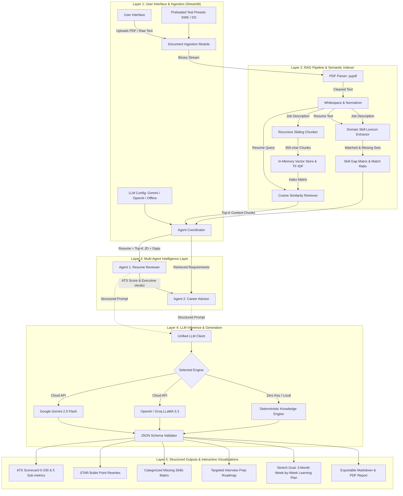
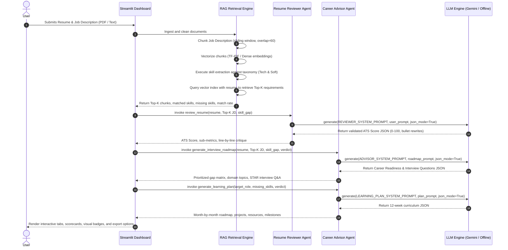

# Architecture & System Design: AI Resume & Career Advisor

This document details the architectural layout, component interactions, and data flow of the **AI Resume & Career Advisor** platform.

---

## 1. High-Level Flow (Core Assignment Pipeline)

The system fulfills the foundational pipeline:
$$\text{User} \longrightarrow \text{RAG Engine} \longrightarrow \text{Multi-Agent LLM Orchestrator} \longrightarrow \text{Actionable Response}$$

```
                +---------------------------------------+
                |                 USER                  |
                |   Uploads Resume & Job Description    |
                +-------------------+-------------------+
                                    |
                                    v
                +---------------------------------------+
                |              RAG ENGINE               |
                |  • PDF Extraction & Preprocessing     |
                |  • Recursive Chunking & Overlap       |
                |  • TF-IDF / Vector Embedding Index    |
                |  • Cosine Similarity Retrieval        |
                |  • Skill Lexicon Gap Extraction       |
                +-------------------+-------------------+
                                    | Top-K Chunks & Extracted Gaps
                                    v
                +---------------------------------------+
                |          LLM INFERENCE ENGINE         |
                |  • Agent 1: Resume Reviewer           |
                |  • Agent 2: Career Advisor            |
                |  • Structured JSON Output Schemas     |
                +-------------------+-------------------+
                                    |
                                    v
                +---------------------------------------+
                |               RESPONSE                |
                |  • ATS Compatibility Score (0-100)    |
                |  • Line-by-Line STAR Rewrites         |
                |  • Missing Skills Matrix              |
                |  • Interview Preparation Roadmap      |
                |  • 3-Month Personalized Learning Plan |
                +---------------------------------------+
```

---

## 2. Detailed Multi-Agent & RAG Architecture Diagram



---

## 3. Sequence Diagram (System Interaction Timeline)



---

## 4. Component Responsibility Matrix

| Component | File Path | Core Technology | Primary Responsibility |
| :--- | :--- | :--- | :--- |
| **User Interface** | `app.py` | Streamlit, CSS | Multi-tab dashboard, file uploaders, metric cards, interactive preview, export button. |
| **PDF Extraction** | `rag_engine.py` | `pypdf.PdfReader` | Ingests binary PDF streams, extracts text across pages, strips artifacts and normalizes whitespace. |
| **Chunking & Indexing** | `rag_engine.py` | Python Regex, `scikit-learn` | Sentence-aware recursive chunker with 350-character window and 60-character sliding overlap. |
| **Vector Retrieval** | `rag_engine.py` | TF-IDF & Cosine Similarity | Vectorizes JD chunks, transforms resume into query vector, computes cosine similarity rankings. |
| **Skill Lexicon** | `rag_engine.py` | Regex Taxonomy Matching | Extracts 100+ technical and soft skills, computing exact set intersections and differences. |
| **Reviewer Agent** | `agents/reviewer_agent.py` | Prompt Engineering, JSON Schema | Calculates ATS score across 5 dimensions, identifies weak bullets, provides STAR rewrites. |
| **Career Advisor Agent** | `agents/career_advisor.py` | Multi-Turn Agent Prompts | Synthesizes readiness level, builds interview Q&A roadmap, and constructs 12-week learning plan. |
| **LLM Inference** | `llm_client.py` | `google-genai`, REST, Local Engine | Unified client abstracting Google Gemini, OpenAI, Groq, and a local deterministic engine. |

---

## 5. Failure Modes & Graceful Degradation

1. **Missing or Corrupted PDF**:
   - `extract_text_from_pdf` wraps parsing in a `try...except` block, returning a clean error message and allowing raw text fallback in the UI.
2. **Missing LLM API Key**:
   - System defaults seamlessly to the local deterministic knowledge engine, ensuring continuous testing and grading without crashes or external network latency.
3. **Mismatched or Empty Inputs**:
   - Validation triggers an immediate UI notification instructing the candidate to provide documents or pick a preloaded preset.
4. **LLM Output Formatting Drift**:
   - Agents enforce strict JSON parsing with markdown backtick cleanup (````json ... ````) and automatic fallback schema recovery.
